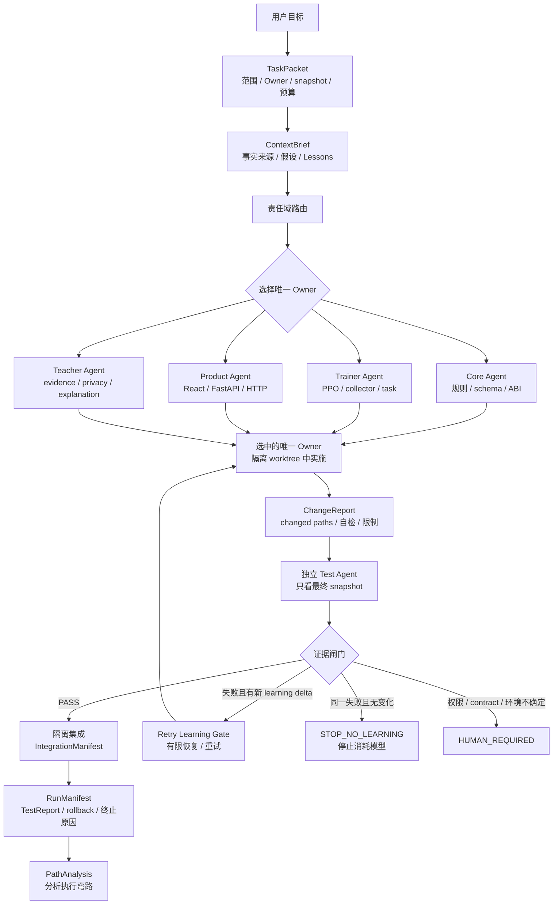
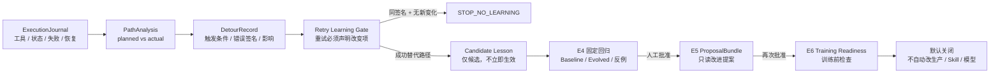
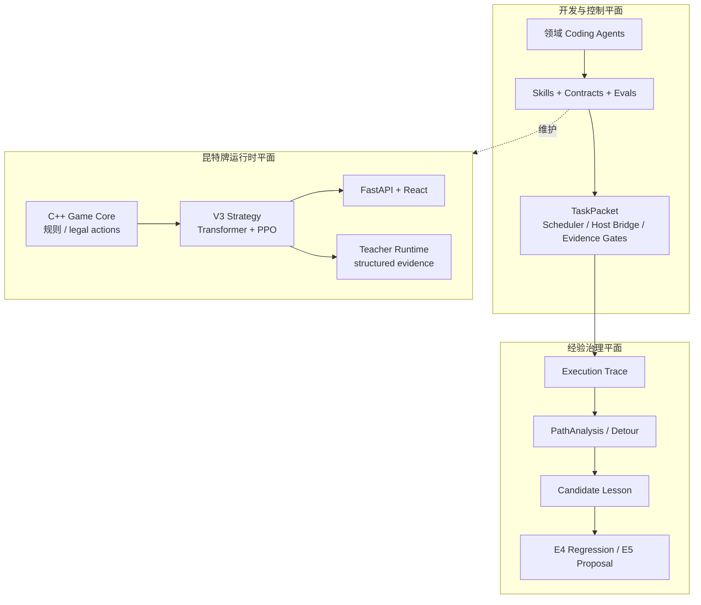

# Gwent-AI：Agent Loop 驱动的昆特牌智能决策与解释系统

Gwent-AI 不只是一个昆特牌模型项目，也是一个可审计的 **Agent Loop + 自进化工程系统**：用专用 Coding Agent、Skill、Contract、独立验证和结构化经验，持续维护 C++ 规则引擎、强化学习、Teacher Runtime 与 Web 产品。

运行时使用 **Transformer + PPO** 策略模型；开发时使用受限、串行、单写者的 Agent Loop。模型负责游戏决策，Agent Loop 负责工程任务的上下文、责任边界、恢复、验证和证据；两者不是同一个自治系统。

> 当前实现状态、现场证据和仍关闭的能力，以 [`docs/current/agent-loop/CURRENT_STATE.md`](docs/current/agent-loop/CURRENT_STATE.md) 为准。本 README 解释系统设计和上手路径，不复制会过期的试点数字。

## 一句话理解

```text
项目需求
  -> 最小上下文装配
  -> 一个领域 Owner 实施
  -> 独立 Test / Verification
  -> 证据闸门
  -> 隔离集成 / rollback
  -> 结构化弯路分析与候选经验
```

默认运行模式是 **串行、单写者、有界、可恢复、证据优先**：`max_concurrency=1`，先由一个 Owner 修改，再由独立 Test Agent 从最终 snapshot 验证。遇到权限、隐私、contract、snapshot、Docker、预算或宿主恢复不确定性，流程停止为 `HUMAN_REQUIRED`。

## Agent Loop 架构

Agent Loop 的核心职责是由主 Codex 编排一次工程任务的生命周期，而不是再增加一个拥有独立业务权限的 Manager Agent。主 Codex 负责目标理解、责任域路由、上下文装配和流程推进；每个任务都绑定不可变的 `TaskPacket`，必要时绑定 `ContextBrief`，再交给 Core、Trainer、Product 或 Teacher 负责领域事实。



这里的关键不是“多开几个 Agent”，而是让每个角色只接收完成工作所需的上下文：

- **上下文先于执行**：先读权威来源、当前 snapshot 和任务边界，再读取对应 Skill、contract 与最近回归；不依赖旧聊天或全仓库扫描。
- **Owner 与 Test 解耦**：Owner 交付最终 commit 和 ChangeReport；Test Agent 不读取 Owner 的实现过程，只验证功能、contract、文件范围和证据。
- **串行而非并行**：同一时刻只有一个写入 Owner；Test 是后置验证者，不与 Owner 并行修改同一工作树。
- **失败先分类再恢复**：区分代码、contract、环境、Docker、权限、协议、flaky 和预算失败，不用“再试一次”掩盖根因。
- **证据绑定 snapshot**：命令、退出码、changed paths、测试报告、模型消耗、耗时和恢复次数都必须绑定可复现的 Git snapshot。

详细入口：[Agent Onboarding Index](docs/current/AGENT_ONBOARDING_INDEX.md) → [START_HERE](docs/current/agent-loop/START_HERE.md) → 当前状态。

## 四个专业 Agent：职责与边界

四个 Agent 是**按事实来源划分的专业 Owner**，不是按编程语言划分的四个聊天窗口。一次任务只选择一个主 Owner；主 Codex 负责编排，跨领域变化通过 contract 和 handoff 串行交接，不再增加一个会重复路由、拥有独立业务权限的第五个模型角色。

| Agent | Skill | 负责的事实与代码 | 明确不负责 | 交接条件 |
|---|---|---|---|---|
| **Core Agent** | [`core-environment`](.agents/skills/core-environment/SKILL.md) | C++ 游戏规则、卡牌效果、legal action、pending choice、C ABI、Observation / Action Grammar | 不在 Python、TypeScript 或 Teacher 中复制规则；不负责 PPO 和 UI | Core HTTP、schema、ABI 或 evidence 字段变化时交给 Product / Trainer / Teacher |
| **Trainer Agent** | [`training-config`](.agents/skills/training-config/SKILL.md) | PPO、collector、reward、Training Task、resume / warm-start、评估和模型 provenance | 不修改产品 runtime 规则；不把 `runs/` 或临时 checkpoint 当作产品模型 | Core schema/action grammar 或产品模型槽位变化时与 Core / Product handoff |
| **Product Agent** | [`product-integration`](.agents/skills/product-integration/SKILL.md) | `apps/web/` 的 React、FastAPI BFF、Core HTTP contract、合法动作交互和 UX | 不 import `gwent_rl`、不加载 C++ shared library 或 checkpoint；不自行推导规则 | HTTP contract 或 Teacher evidence / privacy 受影响时交给 Core / Teacher |
| **Teacher Agent** | [`teacher-explanation`](.agents/skills/teacher-explanation/SKILL.md) | `services/teacher/`、结构化 evidence、解释输出、provider、privacy filter 和 Teacher API | 不重算 legal action、不修改 `option_index`、不参与 reward shaping、不泄露隐藏信息 | 缺少 authoritative evidence 时交给 Core / Strategy；纯 UI 变更交给 Product |

### 一次任务如何选择 Agent

```text
卡牌 / 规则 / schema / ABI       -> Core Agent
训练 / collector / reward / 模型  -> Trainer Agent
React / FastAPI / HTTP / UX       -> Product Agent
解释 / evidence / privacy         -> Teacher Agent
```

Agent 选择后遵循同一条执行链：读取对应任务卡和 Skill → 绑定 contract 与最小上下文 → 在隔离 worktree 实施 → 交付 ChangeReport → 由独立 Test Agent 从最终 snapshot 验证。Test Agent 是验证角色，不是第五个业务 Owner；它不能借验证之名修改生产代码。

## 自进化架构：从弯路到可验证经验

本项目的自进化不是让 Agent 自由修改自身，也不是每次失败后立刻改 Skill 或重训模型。它是一条受闸门约束的经验治理链：记录执行事实，分析可避免的弯路，生成候选经验，经回归和人工批准后才允许形成只读 Proposal。



### 自进化的四条硬边界

1. **经验是建议，不是权威**：Lesson 只能进入 ContextBrief 的 advisory 区域，不能覆盖当前 contract、权限、预算、停止条件或 allowed paths。
2. **重试必须产生学习增量**：每次消耗模型的 retry 都要写明失败签名、改变了什么、前置检查和成功替代动作；同一失败且 delta 不变时自动停止。
3. **成功也不能立即升级规则**：成功重试只生成 candidate-only Lesson；必须经过独立证据、固定回归和人工 Gate，才能进入下一阶段 Proposal。
4. **自进化不等于自动训练**：E6 training-readiness 与正式训练、模型 promotion、Skill/routing 修改默认关闭，必须拥有独立任务、预算和验证证据。

典型路径是：

```text
失败命令
  -> 规范化错误签名
  -> 判断是必要探索还是可避免弯路
  -> 记录成功 fallback 与节省的时间 / token
  -> 生成候选 Lesson
  -> 固定回归验证
  -> 人工批准后才形成只读 Proposal
```

详见 [自进化阶段计划](docs/current/agent-loop/SELF_EVOLUTION_PLAN.md) 和 [经验协议](docs/current/agent-loop/EXPERIENCE_PROTOCOL.md)。

## 三层系统总览



控制平面维护工程过程，经验平面维护已验证的执行知识，运行时平面负责真正的游戏能力。自进化不能绕过控制平面的 contract、权限和证据闸门。

## Skill-driven 开发系统

```text
需求
  │
  ▼
Agent 路由
  │
  ├─ Core Agent     ── $core-environment
  ├─ Trainer Agent  ── $training-config
  ├─ Product Agent  ── $product-integration
  └─ Teacher Agent  ── $teacher-explanation
  │
  ▼
Contract / Invariant / Verification
  │
  ▼
Validated Change
```

四个 Skill 都保存在 `.agents/skills/`，不是一次性 Prompt，而是可复用的工程工作流。每个 Skill 明确：

- **Trigger**：什么时候应该由这个 Skill 接管；
- **Workflow**：先查什么、后改什么；
- **Invariant**：哪些系统边界不能破坏；
- **Reference / Script**：事实来源与自动检查；
- **Verification**：修改完成后必须提供什么证据；
- **Handoff**：什么时候应该停止扩散修改并交给另一个 Agent。

`.agents/evals/` 则验证 Coding Agent 是否遵守这些工程规则。单元测试回答“代码是否正确”，Agent Eval 回答“Agent 是否按正确边界解决问题”。

详见 [Skill 与 Agent 架构](docs/current/SKILL_SYSTEM.md)。

## 两层架构

项目明确区分开发平面和运行时平面。

### Development Plane

```text
Coding Agents
     │
     ▼
Skills + Contracts + Evals
     │
     ▼
源码 / 配置 / 测试 / 产品集成
```

### Runtime Plane

```text
C++ Game Core
     │  legal actions / public state
     ▼
V3 Strategy Core
     │  executed action + evidence
     ├──────────────────────┐
     ▼                      ▼
FastAPI / React        Teacher Runtime
     │                      │
     └────────── UI ◄───────┘
```

核心边界：

- **C++ Game Core**：规则、卡牌效果、状态推进和合法动作的唯一事实来源；
- **Strategy Core**：只在 Core 给出的合法动作中选择；
- **Teacher Runtime**：只解释已经执行的动作，不改变动作、不参与 PPO、不泄露隐藏信息；
- **Web Product**：消费结构化 HTTP contract，不复制规则、不直接加载训练逻辑。

详见 [系统架构](docs/current/ARCHITECTURE.md)。

## C++ Game Core

Core 负责：

- 卡组、手牌、战场、墓地和轮次状态；
- 卡牌效果、状态、天气与触发顺序；
- legal action 与多阶段 decision；
- 动态排内插入位置；
- C ABI / RL observation；
- golden trace、规则回归与 fuzz/stress 测试。

规则层不把合法性复制到 Python 或 TypeScript。跨层只传递结构化 action / state contract。

当前关键规则包括：

- 卡牌进入墓地时恢复当前基础战力；
- 暗影长者先尝试给予 2 点 Bleeding，再结算额外 Bleeding tick；
- Veil 阻止 Bleeding；若 Bleeding 被 Veil 阻止，该目标不会凭空受到后续 Bleeding 伤害。

详见 [Core 与跨层 Contract](docs/current/CORE_CONTRACTS.md)。

## V3 双卡组策略模型

V3 使用一个 checkpoint 同时服务 Deck A 与 Deck B：

```text
                 Shared Representation
                     ~49.6%
                  /           \
                 /             \
        Deck A Private     Deck B Private
            ~50.4%             ~50.4%
              │                  │
         A decisions         B decisions
```

这种结构同时保留通用局面表示和卡组私有策略。运行时根据 deck id 选择对应 private branch，因此产品只需要加载一个 V3 checkpoint。

当前封盘模型来自修正 Veil / Unseen Elder 交互后的 50,000 局 Joint 训练：

| 指标 | 结果 |
|---|---:|
| Best update | u20 |
| Joint score | 55.2% |
| A score vs previous best | 50.9% |
| B score vs previous best | 59.5% |
| Illegal results | 0 |

模型槽位：`models/v3/policy.pt`。

详见 [训练与 V3 模型](docs/current/TRAINING_AND_MODEL.md)。

## Teacher Agent

Teacher 有两层含义：

- **Teacher Coding Agent**：通过 `$teacher-explanation` Skill 维护解释 contract、隐私边界和产品集成；
- **Teacher Runtime**：`services/teacher/`，把 Strategy 的结构化 evidence 转换成 Beginner / Intermediate / Advanced 三档解释。

Teacher Runtime 的原则：

```text
executed action + public evidence -> explanation
hidden hand / hidden alternatives -X-> frontend
Teacher                            -X-> option_index / legal action / reward
```

无外部 LLM 时可使用 deterministic grounded fallback；替换语言 Provider 不改变 evidence 和安全边界。

详见 [Teacher 与 Web](docs/current/TEACHER_AND_WEB.md)。

## Web Product 与本地 Docker

```text
Browser :8080
       │ same-origin /api
       ▼
web / Nginx
       │
       ▼
FastAPI BFF :8010
    /          \
   ▼            ▼
Core :8008   Teacher :8020（可选）
```

对局页包含战场、手牌、合法动作、动态插入位置、AI 决策记录和 AI 教师面板。Teacher 会根据人类当前局面进行一整回合的只读推演，输出“建议动作 -> 必要选择 -> 行动理由”的完整指导链；Teacher 失败不会影响游戏继续。

宿主机只公开 `127.0.0.1:8080`；Core、BFF 和 Teacher 位于 Compose 内部网络。模型目录以只读卷挂载给 Core。

## 仓库结构

```text
.agents/            Skills、references、scripts、Agent Evals
.codex/agents/      Coding Agent 定义
src/ include/       C++ 权威规则核心
python/             RL collector、policy、PPO、evaluation
configs/            算法与训练配置
training/           可执行 Training Task
services/teacher/   Teacher Runtime
apps/web/           React + FastAPI BFF
contracts/          跨层 contract 入口
models/v3/          最终 V3 模型槽位
tests/              C++ regression tests
python/tests/       Python / RL tests
tools/              golden trace、server adapter、profiling 等工程工具
docs/current/       当前系统文档；研发历史统一在 docs/current/archive/（早期回归夹具除外）
```

## 验证入口

Agent Loop / 架构默认检查：

```bash
python3 scripts/check.py architecture
```

全项目 quick 和完整工程测试会进入更广的依赖范围，按任务需要选择：

```bash
python3 scripts/check.py quick
```

```bash
python3 scripts/check.py test
```

更完整的工程测试：

```bash
python3 scripts/check.py full
```

更完整的构建、训练、Teacher 和 Web 启动方式见 [开发与运行](docs/current/DEVELOPMENT.md)。

## Docker 快速开始

### 本地 CPU 人机对战

前置条件：安装 Docker Desktop，并将最终模型放入 `models/v3/policy.pt`。本地推理只需要该模型，不需要服务器训练产生的 `runs/`、中间 checkpoint 或 optimizer state。

```powershell
Copy-Item deploy/docker/.env.example deploy/docker/.env
docker compose --env-file deploy/docker/.env -f deploy/docker/compose.cpu.yml --profile teacher up -d --build
```

完成后打开 [http://127.0.0.1:8080](http://127.0.0.1:8080)。停止服务：

```powershell
docker compose --env-file deploy/docker/.env -f deploy/docker/compose.cpu.yml down
```

### 固定测试容器

测试容器固定 Python 3.10、CPU Torch、pytest 与项目测试依赖，并通过 bind mount 读取当前代码；它不需要启动完整产品服务。

```powershell
docker compose --env-file deploy/docker/.env -f deploy/docker/compose.cpu.yml --profile test build test
docker compose --env-file deploy/docker/.env -f deploy/docker/compose.cpu.yml --profile test run --rm test
```

### 训练 Docker

训练容器直接加载 `libgwent_core.so` 进行 Collector/PPO 采样，不经过 Core HTTP。CPU Docker 用于本地 smoke；GPU 与 `num_envs: 512` 的正式训练只应在训练服务器执行。

```powershell
docker compose --env-file deploy/docker/.env.train -f deploy/docker/compose.train.yml -f deploy/docker/compose.train.cpu.yml build trainer
docker compose --env-file deploy/docker/.env.train -f deploy/docker/compose.train.yml -f deploy/docker/compose.train.cpu.yml run --rm trainer
```

默认 Trainer 命令只检查 smoke task 计划，不会开始训练。详细操作见 [训练 Docker](docs/current/TRAINING_DOCKER.md)。

## 当前文档入口

| 需求 | 首先阅读 |
|---|---|
| 当前架构、版本、验证基线 | [项目基线](docs/current/PROJECT_BASELINE.md) |
| C++ Core / C ABI / schema / grammar | [Core Contracts](docs/current/CORE_CONTRACTS.md) |
| 本地 Docker 对战与测试 | [Local Docker](docs/current/LOCAL_DOCKER.md) |
| 训练 Docker、CPU smoke、服务器 GPU 训练 | [Training Docker](docs/current/TRAINING_DOCKER.md) |
| AI 教师与 Web 集成 | [Teacher and Web](docs/current/TEACHER_AND_WEB.md) |
| 新 Agent / 新对话快速上手 | [Agent Onboarding Index](docs/current/AGENT_ONBOARDING_INDEX.md) |
| Agent Loop 基础规范 | [Agent Loop Foundation](docs/current/AGENT_LOOP_PLAN.md) |
| Agent Loop 三阶段路线图 | [Agent Loop Roadmap](docs/current/agent-loop/IDEAL_LOOP_3_STAGE_PLAN.md) |
| Agent Loop 项目导航 | [Agent Loop Navigation](docs/current/AGENT_LOOP_NAVIGATION.md) |
| 测试矩阵与未执行项 | [Project Test Plan](docs/current/PROJECT_TEST_PLAN.md) |
| Skill / Coding Agent 体系 | [Skill System](docs/current/SKILL_SYSTEM.md) |
