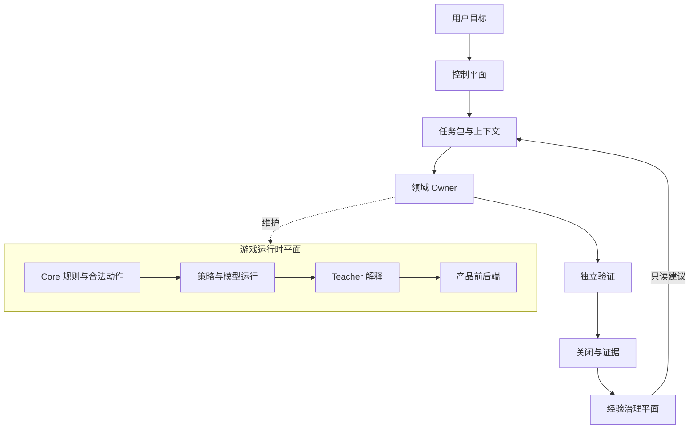
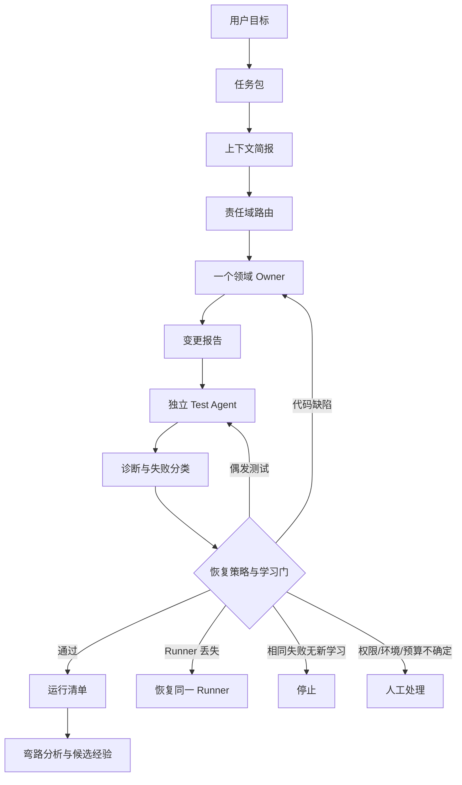
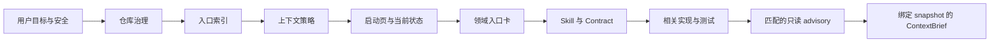
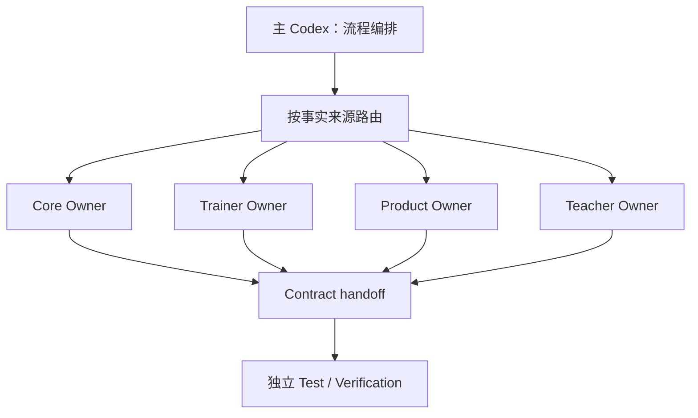
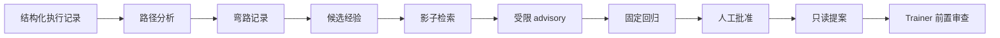

# Gwent Agent Loop 架构手册

> 本手册是解释层，帮助新开发者和新 Agent 理解项目的任务运行方式。
> 它不取代规则、Skill、Contract、TaskPacket 或现场状态报告。
>
> 发生冲突时，按 [`CONTEXT_INDEX.yaml`](CONTEXT_INDEX.yaml) 的权威顺序裁决；
> 当前能力和现场证据只看 [`CURRENT_STATE.md`](CURRENT_STATE.md)；历史报告只用于追溯。

## 使用说明：先读什么

### 这本手册解决什么问题

读完后，读者应能回答：

1. Agent Loop 和 Gwent 游戏运行时是不是同一个循环；
2. 主 Codex、领域 Owner、独立 Test Agent 各自做什么；
3. 一个任务如何从接收走到关闭；
4. 上下文为什么要分层，哪些信息不能装入子任务；
5. Runner 丢失、测试失败、Docker 不可用和预算耗尽分别怎么办；
6. 一次重试怎样沉淀为候选经验，以及为什么不能马上改变规则；
7. 如何判断“代码实现了”与“现场闭环通过”不是同一个结论。

### 文档职责

| 文档 | 唯一职责 |
|---|---|
| [`../AGENT_ONBOARDING_INDEX.md`](../AGENT_ONBOARDING_INDEX.md) | 新对话读取顺序、责任域路由和最小事实集 |
| [`CONTEXT_INDEX.yaml`](CONTEXT_INDEX.yaml) | 机器可检查的上下文策略、权威顺序和排除项 |
| [`START_HERE.md`](START_HERE.md) | 串行 Loop 的执行顺序、停止条件和交付协议 |
| [`CURRENT_STATE.md`](CURRENT_STATE.md) | 当前能力、当前限制和现场证据 |
| 对应 Skill 与 Contract | 领域事实、工程不变量和接口语义 |
| 本手册 | 解释这些文件怎样共同工作，不复制易变结论 |

### 三种结论必须分开

- **已实现**：代码或文档中存在对应机制，并通过了针对性检查；
- **已验证**：有绑定 snapshot、命令、退出码和证据的实际运行记录；
- **已开放**：允许在当前任务中自动使用。一个能力可以已实现、已验证，但仍因权限或人工闸门保持关闭。

正文尽量使用中文；只有代码字段、文件名、角色名和必须与校验器完全一致的协议值保留英文。

要实际运行任务，必须回到 `START_HERE.md`、TaskPacket、TestMatrix 和当前状态，不能只凭本手册操作。

### 章节与权威来源导航

本表只负责定位，不复制权威文档内容：

| 章节 | 优先来源 | 解决的问题 |
|---|---|---|
| 第 0 章 | `AGENT_ONBOARDING_INDEX.md`、`PROJECT_BASELINE.md` | 先理解项目全貌 |
| 第 1 章 | `PROJECT_BASELINE.md`、对应运行时 Contract | 区分游戏循环和工程循环 |
| 第 2 章 | `AGENTS.md`、`START_HERE.md` | 理解主 Codex 和控制平面 |
| 第 3 章 | `START_HERE.md`、`state_machine.py`、`persistence.py` | 理解状态、事件和恢复投影 |
| 第 4 章 | `AGENTS.md`、`agent-entry/`、`.codex/agents/` | 理解角色和路由 |
| 第 5 章 | 四个领域入口卡、四个 Skill | 理解事实来源和 handoff |
| 第 6 章 | `CONTEXT_INDEX.yaml`、两个上下文模板 | 理解上下文装入和排除 |
| 第 7 章 | `contracts/`、各领域 Contract、报告模板 | 理解接口、快照和证据 |
| 第 8 章 | `CODEX_TRANSPORT.md`、`RECOVERY_POLICY.md`、`scheduler.py` | 理解执行、恢复和预算 |
| 第 9 章 | `TEST_AGENT.md`、`TEST_MATRIX.yaml`、TestReport 模板 | 理解独立验证和 Docker |
| 第 10 章 | `EXPERIENCE_PROTOCOL.md`、`SELF_EVOLUTION_PLAN.md` | 理解弯路分析和自进化 |
| 第 11 章 | `START_HERE.md`、TaskPacket/报告模板 | 从需求走到关闭 |
| 第 12 章 | `LESSONS_LEARNED.md`、`archive/` | 追溯已验证的弯路 |
| 第 13 章 | `CURRENT_STATE.md`、`IDEAL_LOOP_3_STAGE_PLAN.md` | 区分当前能力和未来边界 |
| 附录 | 本手册附录与 `docs/current/` | 查文件、命令、术语和清单 |

---

## 第 0 章：先看懂整个项目

### 0.1 一句话理解

这个仓库同时维护两个系统：

- **Gwent Runtime**：运行昆特牌规则、状态、合法动作和对战服务；
- **Agent Loop**：运行“修改项目”这类工程任务的受控流程。

游戏运行时解决“牌局下一步能做什么”；Agent Loop 解决“哪个 Agent 在什么上下文中修改什么、如何验证和关闭”。

二者可以协作，但不能混成一个 Agent，也不能让 Teacher 运行时反过来决定 Coding Agent 的工程流程。

### 0.2 三个平面



控制平面决定任务身份、顺序、范围、预算、恢复和关闭；运行时平面是被维护的产品；经验治理平面分析已结束任务，不能直接改写权威上下文。

### 0.3 一次任务的最短路径

```text
用户目标
→ TaskPacket
→ ContextBrief
→ 责任域路由
→ 一个 Owner
→ ChangeReport
→ 独立 Test Agent
→ TestReport
→ 必要时隔离集成
→ RunManifest
→ 关闭
```

默认一个写入 Owner、一个独立 Test，`max_concurrency=1`。并行不是当前工作流的前提。

### 0.4 本章结论

Agent Loop 不是“让模型多想几轮”，而是把一次工程任务变成有身份、有上下文、有边界、有验证、有证据的事务。

---

## 第 1 章：项目分层与 Agent Loop 的位置

### 1.1 游戏循环与工程循环

游戏循环通常是：

```text
观察局面 → 生成合法动作 → 选择动作 → 执行动作 → 得到新局面
```

工程循环是：

```text
接收需求 → 装配上下文 → 修改代码 → 独立验证 → 处理失败 → 集成 → 关闭
```

两者都具有状态和转移，但对象不同：

| 对比项 | 游戏循环 | Agent Loop |
|---|---|---|
| 状态 | 牌局状态 | 任务状态、Runner 状态和证据状态 |
| 动作 | 出牌、目标、位置等合法动作 | 读取、修改、测试、恢复、关闭 |
| 事实来源 | Core 规则引擎 | TaskPacket、Skill、Contract、snapshot |
| 失败后果 | 牌局结果或非法动作 | 代码缺陷、范围越界、证据缺失或任务阻塞 |
| 主要安全边界 | 合法动作和信息可见性 | 权限、上下文、快照、预算和独立验证 |

不要用游戏中的策略 Agent 替代工程 Owner，也不要让工程 Teacher 参与牌局决策。

### 1.2 项目目录的功能分层

| 层 | 主要目录 | 事实重点 |
|---|---|---|
| 规则层 | `src/`、`include/`、`tests/` | C++ 规则、状态机、合法动作和 C 接口 |
| 训练层 | `python/src/gwent_rl/`、`configs/training/`、`training/tasks/` | 观察、动作语法、奖励、训练任务和模型来源 |
| 产品层 | `apps/web/` | React、FastAPI BFF、Core HTTP 和界面 |
| Teacher 层 | `services/teacher/` | 结构化证据、解释、隐私过滤和 Provider |
| 控制层 | `scripts/agent_loop/` | TaskPacket、Runner、调度、恢复、报告和集成 |
| 角色层 | `.codex/agents/` | 角色配置和可执行入口 |
| 知识层 | `.agents/skills/`、`docs/current/` | 稳定规则、入口、状态、模板和协议 |

### 1.3 跨层变化如何判断

不按文件后缀机械路由，而按事实所有权判断：

- Observation、Action Grammar 和 C ABI 的权威在 Core；
- PPO、collector、reward、训练任务和 checkpoint 在 Trainer；
- Core HTTP 的消费者和界面在 Product；
- 解释证据和隐私过滤在 Teacher；
- 任务状态、证据和调度在控制平面。

如果一个变化影响两个层，先由权威 Owner 定义 contract，再把明确差异交给消费者。

### 1.4 本章结论

理解分层的核心不是记目录，而是知道“哪一层拥有事实，哪一层只消费事实”。

---

## 第 2 章：控制平面、运行时平面与主 Codex

### 2.1 控制平面负责什么

控制平面负责流程控制，不负责替领域定义业务事实。它至少管理：

- 任务身份和 revision；
- 责任域和 Owner；
- 起始、最终和验证 snapshot；
- 写入范围和测试写入范围；
- 调度顺序和并发上限；
- Runner 生命周期；
- 状态事件和持久化；
- 失败分类和恢复动作；
- 报告校验和关闭条件。

### 2.2 主 Codex 的位置

主 Codex 是当前对话中的编排者，可以理解为控制平面的操作者：

1. 把用户意图整理成可验证目标；
2. 选择责任域和最小事实集；
3. 创建 TaskPacket、ContextBrief 和 Runner；
4. 将任务交给一个领域 Owner；
5. 让独立 Test Agent 从最终 snapshot 验证；
6. 根据证据选择完成、恢复、停止或人工闸门；
7. 汇总 RunManifest，不替业务 Owner 编写领域规则。

主 Codex 具有编排职责，但不等于一个新的业务 Manager Agent。

### 2.3 为什么不增加独立 Manager Agent

额外 Manager 会带来第二套路由、第二套事实解释和更多上下文副本，造成责任漂移、重复规划、上下文膨胀和无证据的模型调用。

当前做法是：主 Codex 控制流程，领域 Owner 定义领域事实，Test Agent 独立检查，调度器只执行确定的生命周期规则。

### 2.4 经验治理平面的位置

经验治理平面接在任务结束后，也可以在任务开始前以只读建议方式被查询：

```text
任务结束 → 规范化 Trace → 分析弯路 → 候选经验
        → 影子检索 → 受限 advisory → 固定回归 → 只读提案
```

经验层不是隐藏 Manager，也不是在线自改代码的后台进程。

### 2.5 本章结论

主 Codex 是流程编排者；“不增加 Manager Agent”针对的是额外的、重复路由的业务管理层。

---

## 第 3 章：Agent Loop 生命周期和状态机

### 3.1 正常状态链

```text
RECEIVED
  → TRIAGED
  → CONTEXTUALIZED
  → PLANNED
  → ASSIGNED
  → IMPLEMENTING
  → REVIEWING
  → TESTING
  → COMPLETED
```

| 状态 | 要回答的问题 |
|---|---|
| `RECEIVED` | 需求是否已被接收并建立任务身份？ |
| `TRIAGED` | 责任域、风险和大致范围是什么？ |
| `CONTEXTUALIZED` | 最小事实集是否已经装配？ |
| `PLANNED` | 范围、验收、预算和交付物是否明确？ |
| `ASSIGNED` | 哪个 Owner 获得了任务？ |
| `IMPLEMENTING` | Owner 是否正在声明范围内修改？ |
| `REVIEWING` | Owner 是否完成自检并形成 ChangeReport？ |
| `TESTING` | 独立 Test 是否从最终 snapshot 验证？ |
| `COMPLETED` | 所有关闭条件和证据是否完整？ |

### 3.2 异常状态

- `BLOCKED`：当前不能继续，但不一定需要用户作决定；
- `HUMAN_REQUIRED`：权限、范围、隐私、快照、预算或外部状态需要人工判断；
- `CANCELLED`：用户或控制面明确取消；
- `SUPERSEDED`：这个 revision 已被新的 revision 取代。

这些状态不是“再试一次”的别名。

### 3.3 合法回退

确定性状态机只接受显式转移：

- 正常状态按线性顺序推进；
- `REVIEWING` 或 `TESTING` 发现可修复问题时可以回到 `TRIAGED`；
- 任意非终止状态可以进入阻塞、人工、取消或被取代状态；
- `COMPLETED`、`CANCELLED`、`SUPERSEDED` 不能继续转移。

若范围、contract、snapshot 或责任域改变，必须创建新的 revision 或重新生成相关工件。

### 3.4 事件、顺序和幂等

每个状态事件至少包含：

```yaml
event_id: unique-id
event_seq: 7
from_status: REVIEWING
to_status: TESTING
task_revision: 3
```

控制面检查 revision、连续序号、起始状态、合法目标状态和 event id。已经处理过的 event id 只做幂等重放，不重复改变状态。

### 3.5 持久化

```text
.agent-loop/tasks/<task_id>/
├── state.json
├── events.ndjson
├── artifacts/
└── locks/
```

`state.json` 是当前投影，`events.ndjson` 是追加式事件记录。恢复时重放投影中缺失的事件；写入使用临时文件替换，避免半写文件成为新的事实。

### 3.6 不要混淆三套状态

| 系统 | 例子 | 作用 |
|---|---|---|
| 任务状态机 | `REVIEWING`、`TESTING` | 描述整个任务生命周期 |
| 调度任务状态 | `queued`、`running`、`paused`、`completed` | 描述队列和执行状态 |
| Runner 状态 | `running`、`interrupted`、`lost`、`closed` | 描述执行载体是否存在 |

Runner `lost` 不等于任务失败；它首先触发诊断和恢复决策。

### 3.7 本章结论

状态机是“任务走到哪一步”的事实；恢复策略是“失败后下一步做什么”的决策；学习门是“是否允许为重试消耗模型调用”的门槛。三者不能合并。

---

## 第 4 章：主 Codex、四个领域 Agent 与 Test Agent

### 4.1 角色总览

| 角色 | 负责的事实 | 典型入口 | 不能做什么 |
|---|---|---|---|
| Core Owner | 规则、合法动作、观察和 C 接口 | `CORE.md`、Core Skill | 不在 Python/前端复制规则 |
| Trainer Owner | 训练、collector、奖励、任务和模型来源 | `TRAINER.md`、Trainer Skill | 不绕过模型来源和 Contract |
| Product Owner | React、FastAPI BFF、Core HTTP 和界面 | `PRODUCT.md`、Product Skill | 不直接加载模型或重算合法动作 |
| Teacher Owner | 解释证据、隐私过滤和 Teacher API | `TEACHER.md`、Teacher Skill | 不重算动作、不泄露隐藏信息 |
| Test / Verification | 独立验证和报告 | `TEST_AGENT.md`、TestMatrix | 不修改生产代码制造 PASS |
| Context / Integration | 上下文组织、交接和隔离集成 | 控制面文档 | 不替领域定义 Contract |

### 4.2 Core Owner

Core 是规则和合法性的事实来源。涉及卡牌效果、状态机、pending choice、目标和位置、legal action、observation/action schema、C ABI、golden、trace 和规则对拍时路由给 Core。

下游只能消费 Core 返回的结构化结果。Product 或 Teacher 如果缺少需要展示的字段，应提出 Contract 变化，而不是从 `label`、`source` 或 `target` 文本反推规则。

### 4.3 Trainer Owner

Trainer 管理算法和模型生命周期：

- `configs/training/` 是算法和实验参数；
- `training/tasks/` 是正式运行任务；
- `runs/` 是可再生成输出；
- `artifacts/` 是长期固定资产；
- warm-start、resume、schema 兼容和 promotion 需要明确来源。

Agent Loop 架构任务默认不读取、哈希、迁移或替换冻结模型槽位；只有明确的 Trainer Task 才进入模型验证。

### 4.4 Product Owner

Product 维护 `apps/web/` 的 React 和 FastAPI BFF：

- 前端只显示 Core 返回的合法动作；
- 原样提交 `option_index`；
- BFF 使用严格、版本化的 HTTP 模型；
- 不 import `gwent_rl`，不加载 C++ shared library，不直接加载 checkpoint；
- Teacher 数据通过结构化 Contract 交接。

### 4.5 Teacher Owner

Teacher 是解释层，不是第二个决策器：

- 只能解释 Strategy 已执行的动作；
- 解释必须来自结构化 evidence；
- 必须经过隐私过滤；
- 不能重算 legal action；
- 不能泄露 AI 隐藏手牌、未公开候选动作或内部提示。

运行时 Teacher 和 Teacher Coding Agent 也要分开：前者是产品组件，后者是维护该组件的开发角色。

### 4.6 Test Agent

Test Agent 从 Owner 的最终 commit/snapshot 开始，不读取 Owner 的思考过程和中间改动。它负责复核 changed paths、检查任务要求和 Contract、执行 TestMatrix 指定命令、检查 Docker health/失败分类/cleanup，并输出 TestReport 或 ReviewReport。

它可以在 TaskPacket 声明的 `test_write_roots` 内维护测试，但不能以改测试代替修生产代码。

### 4.7 领域路由的判断方法

```text
先问：哪个事实被改变？
  → 找权威 Owner
再问：谁消费这个事实？
  → 安排串行 handoff
最后问：谁独立验证？
  → 安排 Test Agent
```

跨域任务不是“每个目录启动一个 Agent”。一个主 Owner 先完成权威变化，下一个 Owner 只接收 Contract 差异和必要工件。

### 4.8 本章结论

四个领域 Agent 是四个事实边界；Test Agent 是独立验证边界；主 Codex 是流程编排边界。它们不应该互相替代。

---

## 第 5 章：Skill、事实来源和责任边界

### 5.1 Skill 是什么

Skill 不是项目百科，也不是一次任务的聊天摘要。它是重复出现、已经稳定的工程判断的可复用协议。

一个合格 Skill 至少包含：

1. **Trigger**：什么任务必须读取；
2. **Workflow**：按什么顺序处理；
3. **Invariant**：哪些边界绝不能破坏；
4. **References / scripts**：事实来源和自动检查；
5. **Verification**：完成前必须给出的证据；
6. **Handoff**：什么时候停止并交给另一个 Owner。

### 5.2 入口卡与 Skill 的分工

入口卡只回答“从哪里开始”：找哪个 Owner、读哪个 Skill、读哪些最小 Contract、跑什么最小验证、什么时候 handoff。

Skill 再回答“如何实施”：领域 workflow、领域不变量、领域风险、领域命令和验证。

入口卡不复制 Skill，Skill 也不复制当前状态数字。

### 5.3 权威优先级

概念上的优先级是：

```text
用户请求与安全边界
  → AGENTS.md
  → 领域 Skill 与 Contract
  → 当前代码与 snapshot
  → TaskPacket 与报告
  → 历史归档
```

如果 Contract 和当前代码冲突，不能自行猜哪个正确，应进入人工或权威 Owner 处理。

### 5.4 四个 Skill 的重点

| Skill | 重点 |
|---|---|
| Core | 规则事实、合法动作、schema、C ABI、golden/trace |
| Trainer | 配置与正式任务、resume/warm-start、模型 provenance、评估 |
| Product | Core HTTP、BFF、前端动作渲染、服务集成 |
| Teacher | evidence、解释、隐私、Provider 和响应 schema |

### 5.5 Handoff 应该交什么

跨边界交接至少交：

- TaskPacket；
- ContextBrief；
- Owner 的 ChangeReport；
- 最终 snapshot；
- Contract 差异；
- 验证结果和未决风险。

不交父对话全文、不交未经筛选的全仓库搜索结果、不把推测当事实。

### 5.6 本章结论

稳定规则进 Skill，任务事实进 TaskPacket/ContextBrief，当前能力进 CURRENT_STATE，历史教训进 Lessons。职责分开，Agent 才不会每次重新试错。

---

## 第 6 章：TaskPacket、ContextBrief 与上下文治理

### 6.1 TaskPacket 是什么

TaskPacket 是一次任务的不可变输入。它把自然语言需求变成可执行边界，至少固定：

- `task_id` 和 `revision`；
- 标题、目标和非目标；
- Owner、责任域和必读 Skill；
- Git snapshot 或工作树清单；
- allowed write paths、测试可写目录和 forbidden paths；
- Contract 影响；
- 验收条件、命令、Docker 需求和 cleanup；
- Owner/Test 尝试次数、Runner 恢复次数、token、turn 和时间预算；
- 输出工件目录。

简化示例：

```yaml
protocol_version: 1
task_id: GW-EXAMPLE-001
revision: 1
title: "修复 Product 面板的一个小型 API/UI 行为"
requested_outcome: "在不改变 Core contract 的前提下修复界面展示"
non_goals:
  - "不修改 Core 规则"
  - "不读取或替换模型"

ownership:
  primary_owner: product
  consulted_owners: []

scope:
  allowed_write_paths:
    - apps/web/frontend/...
  allowed_test_write_paths:
    - apps/web/backend/tests/...
  forbidden_paths:
    - models/...
    - src/...

workspace:
  snapshot_kind: git_commit
  snapshot_ref: "git:<commit>"

acceptance:
  behavioral:
    - "界面显示正确"
  verification_commands:
    - "<TaskMatrix 中声明的命令>"

execution:
  max_owner_attempts: 2
  max_role_runs: 6
  max_subtasks: 1
  max_model_turns: 14
```

示例中的数值只是格式说明；实际任务必须根据风险填写，不能复制占位值。

### 6.2 ContextBrief 是什么

ContextBrief 是任务实际使用的最小事实图，不是父对话的压缩版。它记录 included/excluded refs、未决 authority conflicts、当前/期望行为、假设、`context_floor_refs`、`fact_source_graph`、事实状态、相关 Lessons 和 advisory 区域。

### 6.3 上下文装配顺序

```text
用户目标与安全
→ 仓库治理
→ Onboarding 索引
→ ContextIndex 策略
→ START_HERE
→ CURRENT_STATE
→ 领域入口卡
→ Skill 与 Contract
→ 最近实现、测试和 Lessons
→ 任务专属 ContextBrief
```

经验检索放在权威上下文之后。经验只能帮助避开已知弯路，不能先于事实来源定义任务。

### 6.4 上下文装入和排除

应装入用户目标、TaskPacket、revision 和 snapshot、领域入口卡、Skill、相关 Contract、直接相关实现/测试以及触发条件匹配的 confirmed Lesson advisory。

默认排除父对话全文、原始 prompt、无范围全仓库扫描、历史归档、旧 Pilot 兼容夹具、无关 Skill、冻结模型、外部 ZIP 和未确认候选经验。

排除不是丢失信息，而是防止信息污染任务判断。需要追溯时再按索引打开。

### 6.5 一致性检查

开始实施前确认：

1. 所有当前事实都有来源；
2. 代码事实绑定同一个 snapshot；
3. TaskPacket revision 和 ContextBrief 一致；
4. 入口卡、Skill 和 Contract 没有矛盾命令；
5. 历史数字没有写成当前数字；
6. advisory 没有进入权威事实区；
7. unknown 没有被擅自当成 confirmed；
8. 未决冲突已记录，必要时停止为 `HUMAN_REQUIRED`。

### 6.6 上下文预算

目标不是把更多文本塞给模型，而是让每个 token 都有用途：先放规则和范围，再放相关 Contract、实现和测试，最后放有触发条件的 advisory；历史只放引用，不放全文。

经验层限制 advisory 项数和估算 token；超出上限的内容进入 omitted，不挤占事实底座。

### 6.7 新 Agent 冷启动模板

```text
先读取 AGENTS.md、docs/current/AGENT_ONBOARDING_INDEX.md、
docs/current/agent-loop/CONTEXT_INDEX.yaml、START_HERE.md 和 CURRENT_STATE.md。
然后读取责任域入口卡、对应 Skill、相关 Contract、实现、测试和 Lessons。
不要扫描全仓库、读取模型、读取完整聊天记录或把候选经验当规则。

目标：<一句话目标>
责任域：<core | trainer | product | teacher | test | loop>
基线 snapshot：<commit 或工作树清单>
允许写入：<精确路径>
验证命令：<TaskPacket/TestMatrix>
停止条件：<权限、范围、快照、预算、隐私或 contract 不确定时 HUMAN_REQUIRED>
```

### 6.8 上下文失败时怎么办

- 缺少权威来源：停止并标记 `missing_authority`；
- Contract 冲突：交给权威 Owner 或人工；
- snapshot 漂移：重新创建 revision 或固定新的 snapshot；
- 隐私不确定：停止，不让 Teacher 猜测；
- 经验检索不可用：继续使用基线 ContextBrief，并记录 unavailable；
- 上下文过大：压缩引用和排除项，不删除安全底座。

### 6.9 本章结论

上下文管理的本质是“选择、排序、绑定和排除”，不是单纯摘要。结构化 ContextBrief 让新会话不依赖临时记忆，也让恢复任务不必重新试错。

---

## 第 7 章：Contract、Snapshot 与 Artifact

### 7.1 Schema 与 Contract 的区别

- **Schema**：数据长什么样，例如字段、类型和维度；
- **Contract**：模块怎样协作，包括字段语义、版本、所有权、兼容性和错误边界。

改变一个字段类型可能是 schema 变化；改变字段含义、合法动作来源或隐私语义，则可能是 breaking change。

### 7.2 主要 Contract

| Contract | 权威方向 | 典型消费者 |
|---|---|---|
| Environment Contract | Core | 规则、训练和测试 |
| Observation / Action Contract | Core | Trainer、Strategy、产品适配器 |
| Core HTTP Contract | Core 定义，Product 消费 | FastAPI、React |
| Teacher Evidence Contract | Strategy/Core 暴露结构化事实 | Teacher、BFF、面板 |
| Task / Handoff Contract | Agent Loop | Owner、Test、集成控制面 |
| Test / Report Contract | Test 与控制面 | TestReport、RunManifest、闸门 |

### 7.3 Contract 变化流程

```text
识别变化
→ 找权威 Owner
→ 判断是否 breaking
→ 更新唯一版本来源
→ 同步直接消费者
→ 运行针对性测试
→ 通过 handoff 交给下一个角色
→ 由独立 Test 验证最终 snapshot
```

禁止在下游复制规则、解析展示文本、修改测试断言适应错误 Contract，或让 Teacher 从自然语言猜证据。

### 7.4 Snapshot 的作用

Snapshot 是可复现的代码和配置状态，用来绑定 Owner 起点、Owner 最终交付、Test 输入、集成来源与目标、回滚证据以及 Lesson 证据来源。

没有 snapshot，无法证明“测试验证的就是 Owner 修改的那份代码”。

### 7.5 Artifact 类型

| 工件 | 作用 | 创建时机 |
|---|---|---|
| TaskPacket | 不可变任务边界 | 任务开始前 |
| ContextBrief | 实际上下文边界 | 事实装配时 |
| ChangeReport | Owner 改了什么、测了什么 | 每次 Owner attempt 后 |
| HandoffReport | 跨域交接内容 | Contract 变化或角色转换时 |
| ReviewReport | 审阅结论 | 需要人工或协议复核时 |
| TestReport | 独立测试证据 | Test 从最终 snapshot 启动后 |
| RunManifest | 全任务状态、预算、角色运行和终止原因 | Loop 全程 |
| IntegrationManifest | 隔离集成、最终提交和 rollback | 集成时 |
| PathAnalysis | 计划路径与实际路径比较 | 任务关闭后 |
| Lesson | 可验证的候选或确认经验 | 弯路分析后 |

### 7.6 证据链

```text
TaskPacket
  → ContextBrief
  → ChangeReport
  → final snapshot
  → TestReport
  → IntegrationManifest
  → RunManifest
  → PathAnalysis
  → Candidate Lesson
```

每个结论都应能沿这条链回到命令、退出码、文件范围和 snapshot。

### 7.7 报告与状态的边界

- `CURRENT_STATE.md` 说项目当前具备什么，不承载单次任务完整报告；
- `RunManifest` 说一次任务发生了什么，不改变长期 Contract；
- `TestReport` 说某个 final snapshot 的测试结论，不替代 Owner 自检；
- `Lesson` 说一次经验是否值得后续观察，不覆盖 Skill；
- `IntegrationManifest` 说某次隔离集成和回滚，不等于已自动改写父 main。

### 7.8 本章结论

Contract 保证模块说同一种语言；snapshot 保证大家验证的是同一份代码；Artifact 保证过程可以恢复和审计。

---

## 第 8 章：Runner、Scheduler、恢复和预算

### 8.1 Runner 的职责

Runner 是一次 Agent 执行的载体，不是领域决策器。基本生命周期是：

```text
open → wait → (interrupt / resume) → close
```

事件还要携带任务身份、角色、profile revision、起始 snapshot、write scope、`runner_ref`、resume 次数、报告、final snapshot、changed paths、token 和耗时。

### 8.2 本地 Codex CLI Host Bridge

当前本地桥接层负责：

1. 校验项目、Git snapshot、TaskPacket、ContextBrief 和 Profile；
2. 在隔离 worktree 或自包含 clone 中创建任务；
3. 启动受限的 Codex CLI 进程；
4. 将宿主返回值映射为统一 RunnerEvent；
5. 持久化 thread、PID、worktree、日志和任务身份；
6. 在新 Scheduler 进程中用原 `runner_ref` 查找并 rebind；
7. close 时校验范围、生成提交并清理它自己创建的临时资源。

rebind 不是“新会话重新学会”，而是新控制进程找到旧任务的持久身份并接回同一责任链：

```text
旧 Scheduler
  → 保存 task_id / runner_ref / PID / worktree
  → 进程退出
新 Scheduler
  → 读取状态
  → lookup runner_ref
  → 校验 task identity
  → rebind 原 Runner
  → 继续 wait 或 resume
```

如果找不到原 Runner，不能偷偷 create 一个新任务冒充恢复。

### 8.3 Scheduler 的职责

Scheduler 负责校验和接收 TaskPacket、FIFO 排队、按 owner 路由、控制 `max_concurrency`、周期性 poll、暂停/恢复/取消、计算累计使用量以及持久化调度快照和事件。

Scheduler 不负责修改领域代码、定义领域 Contract、代替 Test Agent 判断功能正确、预算耗尽后启动新任务，或把失败任务切换到不匹配的角色。

### 8.4 为什么默认串行

当前 `max_concurrency=1` 的原因是：

- 一个时刻只有一个写入者，减少冲突；
- 上下文、snapshot 和报告容易绑定；
- handoff 顺序清楚；
- 失败和恢复可以逐步审计；
- 不需要把并行冲突问题伪装成更多智能。

暂停中的任务仍占用调度槽，避免暂停后面的任务越过它改变 FIFO 语义。

### 8.5 有界预算

预算应覆盖整个任务或 Scheduler，而不是只限制一次 Agent：最大角色运行数、最大子任务数和深度、最大输入/输出 token、最大模型回合、最大耗时、Owner attempt、Runner resume、Docker 使用范围和 cleanup 时间。

预算在启动前预留、每次事件后累计、超限时停止新的模型工作。零值不能被解释成“没有成本”，只有反事实基线才允许计算节省。

### 8.6 诊断、恢复策略和学习门

```text
失败事件
  → 诊断：发生了什么、属于哪类失败？
  → 恢复策略：流程下一步是返回、重测、恢复还是人工停止？
  → 学习门：若要重试，是否有新的结构化学习增量？是否允许消耗模型？
```

诊断不应猜根因；恢复策略不应改变业务 Contract；学习门不应修改生产代码。

### 8.7 恢复决策

| 情况 | 决策 | 结果 |
|---|---|---|
| 测试和报告完整通过 | `COMPLETE` | 关闭，不再调用模型 |
| 用户取消 | `STOP` | 关闭 |
| 报告缺失或互相矛盾 | `WAIT_HUMAN` | 人工处理 |
| 预算耗尽 | `STOP_BUDGET` | 停止新的模型工作 |
| Runner 丢失且有恢复额度 | `RESUME_SAME_RUNNER` | 只恢复同一 Runner |
| Runner 丢失且无法证明恢复 | `WAIT_HUMAN` | 人工处理 |
| Docker 或环境失败 | `WAIT_HUMAN` | 先修环境 |
| 权限或外部依赖问题 | `WAIT_HUMAN` | 请求授权或外部处理 |
| 控制协议失败 | `STOP` | 保留证据检查 |
| 可证明的偶发测试失败 | `RETRY_TEST` | 允许有限重测 |
| Owner 代码缺陷且仍有额度 | `RETURN_TO_OWNER` | 新 Owner attempt |
| 相同失败且没有新学习 | `STOP_NO_LEARNING` | 停止重试 |

`RESUME_SAME_RUNNER` 是同一逻辑尝试的恢复，不等于新 Lesson；`RETURN_TO_OWNER` 和 `RETRY_TEST` 才需要通过 Retry Learning Gate。

### 8.8 环境失败的正确处理

```text
启动前预检
→ 发现命令、依赖、Docker 或权限问题
→ 保存 failure class、命令和退出码
→ 停止模型调用
→ 修复外部环境或请求人工
→ 环境改变后再创建新的有界 attempt
```

环境失败不能靠增加模型预算解决。不要在 `python` 不存在时盲目试很多别名，也不要把宿主依赖失败写成代码失败。

### 8.9 本章结论

Runner 解决“任务在哪里运行”；Scheduler 解决“任务按什么顺序运行”；Recovery Policy 解决“失败后能否继续”；预算解决“最多消耗多少”。

---

## 第 9 章：独立验证、Docker 和集成闸门

### 9.1 为什么 Owner 不能自己宣布 PASS

Owner 知道自己的实现过程，容易把“我运行过”误认为“功能满足”。独立 Test Agent 从最终 snapshot 开始，按任务声明复核行为、Contract、范围和证据。

独立不是为了增加角色数量，而是为了隔离判断依据。

### 9.2 Test Agent 的输入

Test Agent 至少接收 TaskPacket、ContextBrief、Owner ChangeReport、base/final snapshot、TestMatrix、测试写入范围、Docker allowlist、cleanup 责任、验收命令和报告格式。

它不应接收父对话全文和 Owner 的内部推理。

### 9.3 验证的四个层次

| 层次 | 检查内容 |
|---|---|
| 功能 | 用户目标是否真实满足 |
| Contract | 字段、版本、语义和边界是否一致 |
| 范围 | changed paths 是否在声明范围内 |
| 证据 | 命令、退出码、日志、环境和报告能否复现 |

涉及 Teacher 时还要检查隐私；涉及服务时还要检查 health、失败注入和 cleanup；涉及集成时还要检查最终 snapshot 和 rollback。

### 9.4 Docker 的正确定位

Docker 不是所有任务的默认入口。只有 TaskPacket 和 TestMatrix 明确声明服务依赖时，才使用对应 allowlist。

对于 Product、Teacher 和 Agent Loop 的 Python pytest，固定测试镜像是权威环境；宿主 pytest 只用于诊断依赖差异。宿主机通过不代表 Docker 证据，宿主机失败也不一定是代码失败。

### 9.5 Docker 运行前预检

```bash
docker info
```

还要确认当前任务确实声明 Docker、compose 文件和服务在 allowlist、资源所有权明确、有 bounded timeout，并且运行后能收集 health、日志、退出码和 cleanup 证据。

共享项目禁止执行全局 `docker compose down`。未知资源所有权时必须 `HUMAN_REQUIRED`。

### 9.6 TestReport 必须说明什么

合格报告至少包含 final snapshot、实际命令和退出码、通过/失败/未执行/不确定项、failure class、changed test paths，以及 Docker runner、compose files、health、日志和 cleanup（若使用 Docker）。还要给出 Contract、范围、隐私和下一步结论。

状态枚举必须严格匹配报告校验器。未知状态不能被翻译成 PASS。

### 9.7 失败分类

测试报告的失败分类至少区分：`CODE_DEFECT`、`CONTRACT_GAP`、`ENVIRONMENT_FAILURE`、`DOCKER_FAILURE`、`PERMISSION_REQUIRED`、`FLAKY_TEST`、`PROTOCOL_FAILURE`、`BUDGET_EXHAUSTED` 和 `EXTERNAL_DEPENDENCY`。`HUMAN_REQUIRED` 是控制面的最终处理结果，不是测试报告中的失败分类；它表示需要人工判断或外部处理。

分类不能用来掩盖失败。例如 Docker 不可用不能写成“测试通过但没运行”。

### 9.8 集成闸门

只有 final snapshot、changed paths、Contract 差异、合法 TestReport、预算、parent 改动边界和 rollback 方法都明确后，才允许隔离集成。

集成优先使用隔离分支或隔离 worktree。直接修改脏 parent/main、解决冲突、删除用户改动仍属于人工闸门，不能因为候选已经测试通过就自动越过。

### 9.9 本章结论

“测试通过”只说明声明范围内的某个 snapshot 通过；“任务完成”还需要范围、Contract、预算、集成和关闭证据全部成立。

---

## 第 10 章：Retry Learning 与自进化

### 10.1 自进化的准确含义

本项目的自进化是工程流程的证据驱动改进，不是模型自由重写自己。它要回答：

> 这次任务哪里绕远了？当时是否有足够信息避免？下次如何在相同条件下减少重复尝试？

它可以改进上下文、前置检查、验证路径和只读提案；不能绕过权限、Contract、预算、独立测试或人工批准。

### 10.2 从执行记录到经验

```text
Execution Trace
  → PathAnalysis
  → DetourRecord
  → Retry Learning Gate
  → Candidate Lesson
  → E2 影子检索
  → E3 受限 advisory
  → E4 固定回归
  → E5 只读提案
  → E6 Trainer 前置审查
```

如果某一步没有证据，就停在当前层级，不得把推测升级成稳定规则。

### 10.3 什么是可避免弯路

满足下列条件之一，才可以标记为 `avoidable_detour`：

- 当时已经有可见的前置检查，但没有执行；
- 相同失败动作在前置条件未改变时重复；
- 选错了环境、入口、文件范围或 Contract；
- 已有成功替代路径，却没有优先使用；
- 最终证据明确证明前一次动作无效。

第一次探索未知环境、首次发现新 Contract 问题或必要的权限确认，默认是 `necessary_exploration` 或 `unclassified_failure`，不能事后强行说成弯路。

### 10.4 Retry Learning Gate

任何 `RETURN_TO_OWNER` 或 `RETRY_TEST` 都必须携带结构化学习增量（`learning_delta`）；是否消耗模型调用，由恢复决策单独记录：

```yaml
schema: agent-loop.retry-learning.v1
kind: preflight_change
summary: "改用已验证的环境预检路径"
failure_signature: "sha256:<脱敏签名>"
changed_refs:
  - "docs/current/agent-loop/TEST_AGENT.md"
preflight_checks:
  - "docker info"
  - "确认 TaskPacket 声明了 docker-test"
new_context_refs: []
preconditions_changed: false
fallback_action:
  tool: docker
  operation: "run allowlisted test image"
  target_scope: "current task only"
```

门至少检查 failure signature 与失败动作一致、changed refs 非空、前置检查非空、fallback action 具体、没有原始聊天或 prompt、引用的 Lesson 已 confirmed/promoted，以及相同失败和相同 delta 没有被重复尝试。

相同失败且没有新学习增量时，动作必须变成 `STOP_NO_LEARNING`，不能继续消耗模型。

### 10.5 Runner 恢复不等于自进化

Runner 丢失后 `RESUME_SAME_RUNNER` 只是恢复同一个逻辑尝试：需要恢复证据和 resume 预算，不改变 Owner、snapshot 或 Contract，也不要求为了“看起来学习了”而新增 Lesson。

真正的自进化发生在任务有完整 Trace 和最终证据之后。

### 10.6 Lesson 的最小结构

```yaml
id: LESSON-<digest>
status: candidate
scope: loop
trigger:
  domain: project
  task_type: path_scoped_integration
  changed_paths:
    - "docs/current/..."
  preconditions:
    - dirty_parent
avoidance:
  when:
    - "外部 parent 有无关用户改动"
  avoid:
    - "在身份不匹配的 index 上做宽范围操作"
  prefer:
    - "显式路径变更并逐路径校验"
  preflight:
    - "git status --short"
evidence:
  detour_id: DETOUR-<id>
  snapshot: "git:<commit>"
  sources:
    - ref: "RunManifest"
    - ref: "TestReport"
privacy:
  redacted: true
  contains_secrets: false
```

Lesson 记录观察事实和适用条件，不保存完整 prompt、聊天记录、token、cookie、隐藏信息或未经脱敏的错误原文。

### 10.7 E0 到 E6 的边界

| 阶段 | 作用 | 能否改变正式规则 |
|---|---|---:|
| E0 | 记录和规范化执行事实 | 否 |
| E1 | 分析弯路、失败和成功回退 | 否 |
| E2 | 影子检索，观察是否命中 | 否 |
| E3 | 生成受限 advisory ContextBrief | 否 |
| E4 | Baseline/Evolved 固定回归和 PromotionReport | 否 |
| E5 | 生成 Skill、路由和验证的只读提案 | 否 |
| E6 | 训练前置资格审查 | 否 |

E5 至少需要两个独立结构化 Lesson，因为一个 Lesson 可能只是偶然、环境特例或错误根因。两个独立来源要求不同的 `detour_id`、证据来源和 snapshot，同时触发条件与成功路径具有可比性。

### 10.8 E2 影子检索

只有 confirmed 或 promoted Lesson 才能进入匹配池。检索比较 domain、task type、changed paths、failure class、preconditions、Contract version 和 snapshot policy。

检索报告只记录 selected、excluded、排除原因、估算 token 和 `model_calls=0`。检索失败时状态为 unavailable，继续使用基线上下文，不阻断主任务。

### 10.9 E3 advisory 注入

E3 生成 ContextBrief 副本，不原地修改基线。advisory 必须单独放在 advisory 区域，保留 statement、when、avoid、prefer、preflight、evidence snapshot 和 source refs。

它不能改变 `context_floor_refs`、允许路径、权限、预算、并发和停止条件。任务结束后才记录采用或未采用结果。

### 10.10 E4 固定回归

E4 至少需要两个 target、一个 control 和一个 safety：

- target 验证目标弯路是否减少；
- control 验证经验不适用时普通任务不受伤害；
- safety 验证禁止或敏感场景不会误启用建议。

Baseline 和 Evolved 必须来自独立证据。比较成功率、可避免弯路、额外工具调用、额外模型回合、上下文 token、恢复耗时、Contract/scope/privacy 违规、false avoidance、negative transfer 和人工介入。

即使机器门禁全部通过，也只能进入 `ready_for_human_gate`；只有人工明确批准才是 `approved`。

### 10.11 E5 只读提案与 E6

E5 产出三类草案：Skill 差异、路由变化、验证计划。三类草案都必须 `read_only=true`、`review_required=true`，不能自动修改正式文件。

E6 只检查是否具备交给 Trainer 审查的条件，不加载 checkpoint、不启动训练、不安装模型、不修改模型或训练目录。

### 10.12 本章结论

自进化的最小闭环是“记录事实、识别弯路、验证回退、受限建议、固定回归、人工批准”。它的价值是减少下一次无意义的试错，而不是让系统无限自改。

---

## 第 11 章：一个完整任务案例

### 11.1 案例范围

选择低风险 Product UI/API 任务，例如修复一个面板展示问题。假设不改 Core 规则、不改模型、不改变 HTTP Contract，只允许修改 `apps/web/frontend/` 中指定文件。

### 11.2 创建 TaskPacket

规划者写清目标、Product Owner、基线 snapshot、允许/禁止路径、验收、独立 Test、Docker 需求、预算和停止条件：

```text
目标：修复面板在某一合法状态下的展示行为
Owner：product
基线：git:<固定提交>
允许写入：apps/web/frontend/<指定文件>
禁止写入：Core、Trainer、模型和未声明服务
验收：界面行为、Contract 未变、指定测试通过
Test：从 Owner final snapshot 独立执行
停止：范围、snapshot、权限、环境或预算不确定时人工停止
```

### 11.3 装配 ContextBrief

读取 Product 入口卡、Product Skill、相关 HTTP Contract、目标组件、对应测试和相关已确认 Lesson。

排除 Core 规则实现、训练配置、模型、无关历史 Pilot、父对话全文和候选经验。

确认 TaskPacket revision、ContextBrief snapshot 和目标文件属于同一基线。

### 11.4 Owner 阶段

Owner 检查 snapshot 和允许路径，读取组件和 Contract，做最小修改，执行自检，写 ChangeReport，固定 final snapshot，并标记 Contract unchanged 或列出 changed。

Owner 不能把自检结果直接当成最终 PASS。

### 11.5 Test 阶段

Test Agent 只拿到 TaskPacket、ContextBrief、ChangeReport 和 final snapshot：核对 snapshot、changed paths、Contract，执行声明命令，读取退出码，按需检查 Docker health，最后写 TestReport。

### 11.6 失败分支

代码问题：

```text
TestReport → CODE_DEFECT
→ RETURN_TO_OWNER
→ Retry Learning Gate
→ 新 Owner attempt
→ 新 ChangeReport
→ Test 从新 final snapshot 验证
```

Docker 权限问题：

```text
TestReport → PERMISSION_REQUIRED / DOCKER_FAILURE
→ WAIT_HUMAN
```

同一错误签名再次出现且 delta 不变：

```text
→ STOP_NO_LEARNING
```

Runner 进程丢失但持久化身份和恢复额度存在：

```text
→ lookup runner_ref
→ rebind 原 Runner
→ RESUME_SAME_RUNNER
```

### 11.7 集成与关闭

Test PASS 后，若需要合入，在隔离分支或 worktree 应用候选，生成 IntegrationManifest，记录最终 commit 和 rollback 方法，必要时进行集成后的第二轮独立 Test，最后生成完整 RunManifest。

直接修改有用户改动的 parent/main 仍要单独人工确认，不能因测试通过而自动覆盖不相关内容。

### 11.8 任务关闭后的自进化

只有关闭后的完整 Trace 才进入 PathAnalysis，判断计划内步骤、必要探索、可避免弯路、成功 fallback 和下一次前置检查。没有成功回退证据的失败，不生成可注入 Lesson。

### 11.9 本章结论

一次完整任务不是“Owner 改完就结束”，而是“Owner 交付 → Test 独立确认 → 集成证据 → 关闭 → 弯路分析”的完整链路。

---

## 第 12 章：常见弯路、错误做法和改进经验

### 12.1 命令与环境

| 错误做法 | 问题 | 正确做法 |
|---|---|---|
| 直接运行 `python` | WSL 可能没有该命令 | 先检查并使用 `python3` |
| 把 host pytest 当最终证据 | 依赖可能和固定镜像不同 | Python 测试按声明使用 `docker-test` |
| Docker 失败后继续消耗模型 | 环境问题不会被模型推理修复 | 保存分类并停止到人工闸门 |
| 直接运行全项目 `quick` | 可能进入 Trainer/torch | 架构任务优先 `architecture` |
| Node/npm 不存在时反复猜命令 | 每次失败都没有新信息 | 先做工具预检 |

### 12.2 上下文与入口

| 错误做法 | 后果 | 改进 |
|---|---|---|
| 从旧 Pilot 推断当前能力 | 历史状态污染当前判断 | 只看 CURRENT_STATE |
| 同时把多个启动页当权威 | 规则可能重复或冲突 | 按单向引用读取 |
| 先读候选经验再读 Contract | 经验可能覆盖事实 | 先权威后 advisory |
| 扫描整个仓库 | 上下文大、噪声多 | 由入口卡给出最小事实集 |
| 把聊天记忆当持久化状态 | 换会话后无法复现 | 使用 TaskPacket 和 ContextBrief |

### 12.3 Git 与工作树

| 错误做法 | 风险 | 改进 |
|---|---|---|
| 在脏 main 上自动提交 | 可能把用户 staged 内容一起提交 | 先隔离，按路径验证 |
| 把隔离 worktree 当 Windows 主目录 | 两份代码可能不同步 | 明确记录 worktree 和 snapshot |
| 复制 `.git` 指针文件 | 破坏仓库元数据 | 只复制工作文件或使用 Git 正规操作 |
| 直接大范围覆盖 parent | 无法恢复用户改动 | disjoint candidate 使用隔离集成 |
| 用 `git reset/clean/stash` 清理未知内容 | 可能破坏用户数据 | 未知所有权进入人工闸门 |

### 12.4 重试

“再试一次”不是诊断。每次真正重试前至少回答：上次失败签名、这次改变、改变是否落盘、新增前置检查、成功替代路径、是否消耗模型、再失败时是否会停止。

如果答不出来，就不应该再次调用模型。

### 12.5 经验记录

不好的 Lesson：

```text
以后永远不要使用某工具。
```

好的 Lesson：

```text
当外部 parent 有无关用户改动、且当前 index 身份不匹配时，
某种带 index 的宽范围操作容易失败；先做状态预检，
使用显式路径操作，逐路径确认，再只提交声明路径。
```

好的 Lesson 必须包含 `when`、`avoid`、`prefer` 和 `preflight`，不能把条件化经验写成无条件禁令。

### 12.6 证据质量

以下情况不能声称 PASS：没有 final snapshot、changed paths 未核对、TestReport 状态不合法、Docker health 或 cleanup 没证据、失败没有分类、报告 snapshot 与测试输入不同、没有反事实基线却声称节省、一次偶然成功却声称经验已晋级。

### 12.7 本章结论

自进化首先应消灭“相同条件下的重复错误”，而不是积累越来越多的说明文档。每条经验都应能指导下一次前置检查，并能被回归验证。

---

## 第 13 章：架构权衡、当前状态和未来边界

### 13.1 为什么选择串行

串行模式牺牲吞吐量，换取写入冲突少、snapshot 关系清楚、上下文不在多个 Owner 间同时漂移、handoff 顺序可审计、预算和恢复容易归属。

### 13.2 多角色的收益

四个领域 Agent 带来的不是四倍智能，而是四种清晰的事实边界：Core 不被前端复制规则，Trainer 不被产品任务无意加载，Product 不直接改模型或规则，Teacher 不编造 evidence，Test 不替 Owner 修生产代码。

### 13.3 多角色的成本

需要维护入口卡、Skill、Contract handoff、ContextBrief、snapshot、报告、独立测试环境、恢复和集成证据。这些成本把原本藏在聊天记忆中的风险显式化。

### 13.4 当前状态应该去哪里看

本手册不复制通过数量、试点编号或临时 snapshot。要确认当前做到哪一步，只读 [`CURRENT_STATE.md`](CURRENT_STATE.md)；要确认路线退出条件，读 [`IDEAL_LOOP_3_STAGE_PLAN.md`](IDEAL_LOOP_3_STAGE_PLAN.md)；要追溯历史原因，再打开 archive。

### 13.5 当前明确关闭的能力

未经授权不能自动发生：修改生产代码修复未知问题、解决 parent/main 冲突、扩大文件范围或 Docker allowlist、改变 Contract/路由/权限/预算/停止条件、替换或重训模型、把 Candidate Lesson 晋级为正式规则、用不确定宿主能力冒充可恢复现场。

### 13.6 未来扩展边界

可以继续增强宿主适配、失败签名和 Lesson 去重、反例回归、集成/回滚状态、上下文预算和冷启动指标，但必须保持串行、有界、可审计和 fail-closed。

### 13.7 本章结论

理想 Agent Loop 不是“完全无人控制”，而是：确定的事情自动完成，不确定的事情及时停下，并且每次停止都留下足够证据让下一次无需重新试错。

---

## 附录 A：文件索引

### A.1 新对话入口

- [`../AGENT_ONBOARDING_INDEX.md`](../AGENT_ONBOARDING_INDEX.md)：首次读取和责任域路由；
- [`CONTEXT_INDEX.yaml`](CONTEXT_INDEX.yaml)：机器可检查的上下文策略、权威顺序和排除项；
- [`START_HERE.md`](START_HERE.md)：串行 Loop 的执行顺序、停止条件和交付协议；
- [`CURRENT_STATE.md`](CURRENT_STATE.md)：当前能力、当前限制和现场证据；
- [`ARCHITECTURE_MANUAL_OUTLINE.md`](ARCHITECTURE_MANUAL_OUTLINE.md)：本手册的章节规划。

### A.2 领域入口与 Skill

| 领域 | 入口卡 | Skill |
|---|---|---|
| Core | `docs/current/agent-entry/CORE.md` | `.agents/skills/core-environment/SKILL.md` |
| Trainer | `docs/current/agent-entry/TRAINER.md` | `.agents/skills/training-config/SKILL.md` |
| Product | `docs/current/agent-entry/PRODUCT.md` | `.agents/skills/product-integration/SKILL.md` |
| Teacher | `docs/current/agent-entry/TEACHER.md` | `.agents/skills/teacher-explanation/SKILL.md` |
| Test | `docs/current/agent-loop/TEST_AGENT.md` | TestMatrix 和报告模板 |

### A.3 控制面实现

| 文件 | 作用 |
|---|---|
| `scripts/agent_loop/state_machine.py` | 任务状态转移和事件幂等 |
| `scripts/agent_loop/persistence.py` | 投影、追加事件和原子写入 |
| `scripts/agent_loop/runner.py` | Runner 生命周期协议 |
| `scripts/agent_loop/execution.py` | Runner 事件、预算和恢复接入 |
| `scripts/agent_loop/scheduler.py` | FIFO、暂停、恢复、取消和总预算 |
| `scripts/agent_loop/scheduler_backend.py` | Scheduler 与实际宿主的边界 |
| `scripts/agent_loop/codex_bridge.py` | Codex 项目任务请求构建 |
| `scripts/agent_loop/codex_cli_bridge.py` | 本地 CLI 宿主桥接、隔离和 rebind |
| `scripts/agent_loop/recovery.py` | 确定性恢复决策 |
| `scripts/agent_loop/report_validation.py` | 报告状态和字段校验 |
| `scripts/agent_loop/integration.py` | 隔离集成和回滚证据 |

### A.4 上下文、报告和经验

| 文件 | 作用 |
|---|---|
| `TASK_PACKET_TEMPLATE.yaml` | 不可变任务输入 |
| `CONTEXT_BRIEF_TEMPLATE.yaml` | 最小事实集和实际上下文记录 |
| `CHANGE_REPORT_TEMPLATE.yaml` | Owner 变更报告 |
| `TEST_REPORT_TEMPLATE.yaml` | 独立测试报告 |
| `RUN_MANIFEST_TEMPLATE.yaml` | 全任务运行清单 |
| `INTEGRATION_MANIFEST_TEMPLATE.yaml` | 隔离集成清单 |
| `EXPERIENCE_PROTOCOL.md` | E0–E6 和 Retry Learning 规则 |
| `scripts/agent_loop/experience.py` | Trace 分析和候选经验生成 |
| `scripts/agent_loop/retry_learning.py` | 重试前学习增量校验 |
| `scripts/agent_loop/retrieval.py` | E2 影子检索 |
| `scripts/agent_loop/injection.py` | E3 advisory ContextBrief |
| `scripts/agent_loop/regression.py` | E4 固定回归和 PromotionReport |
| `scripts/agent_loop/proposal.py` | E5 只读提案 |
| `scripts/agent_loop/training_readiness.py` | E6 训练前置审查 |

### A.5 稳定协议和历史证据

| 文件 | 用途 |
|---|---|
| `CODEX_TRANSPORT.md` | 本地 Codex Host 的请求、创建、等待、恢复和关闭边界 |
| `RECOVERY_POLICY.md` | 失败分类到恢复动作的稳定规则 |
| `TEST_AGENT.md` | Test Agent 角色、Docker 和报告边界 |
| `LESSONS_LEARNED.md` | 已确认、可追溯的历史经验 |
| `SELF_EVOLUTION_PLAN.md` | 自进化目标、E0–E6 规划和限制 |
| `archive/` | 历史阶段、Pilot 和讨论；默认不读 |

---

## 附录 B：命令索引

### B.1 开始前预检

```bash
command -v python3
python3 --version
python3 -c 'import yaml'
```

若任务需要 Python 测试：

```bash
python3 -m pytest --version
docker info
```

若任务需要前端构建：

```bash
node --version
npm --version
```

### B.2 架构与 Loop 门禁

```bash
python3 scripts/check.py architecture
python3 scripts/agent_loop/check.py
```

架构任务不应无条件运行会进入 Trainer/torch 的全项目门禁。

### B.3 Docker 权威测试

```bash
python3 scripts/check.py docker-test
```

仅当 TaskPacket 和 TestMatrix 声明了 Docker 需求时执行。报告必须保留 health、日志、退出码和 cleanup。

### B.4 领域测试

```bash
PYTHONPATH=. python3 -m pytest -q services/teacher/tests
PYTHONPATH=apps/web/backend python3 -m pytest -q apps/web/backend/tests
cd apps/web/frontend && npm run build
```

实际选择由领域入口卡和 TaskPacket 决定。命令成功不代表跨领域 Contract 自动通过。

### B.5 经验分析

```bash
python3 scripts/agent_loop/experience.py \
  --trace .agent-loop/tasks/<task>/trace.jsonl \
  --run-manifest .agent-loop/tasks/<task>/RunManifest.yaml \
  --test-report .agent-loop/tasks/<task>/TestReport.yaml \
  --change-report .agent-loop/tasks/<task>/ChangeReport.yaml \
  --domain product \
  --task-type api_contract_change \
  --contract-version product-http=v1 \
  --output-dir .agent-loop/tasks/<task>/experience
```

候选经验只能写入任务的 `experience/`，不能自动进入新的 ContextBrief。

### B.6 E2 到 E6

各阶段必须使用对应模板和脚本：

```text
E2 retrieval.py
E3 injection.py
E4 regression.py
E5 proposal.py
E6 training_readiness.py
```

先读 [`EXPERIENCE_PROTOCOL.md`](EXPERIENCE_PROTOCOL.md) 的输入、输出和禁止事项，再执行命令。

---

## 附录 C：术语表

### C.1 核心术语

| 术语 | 含义 |
|---|---|
| Agent | 执行某类任务的模型角色 |
| Agent Loop | 受控的工程任务生命周期 |
| Skill | 稳定、可复用的领域工程知识和约束 |
| Contract | 模块之间关于字段、语义和边界的协作协议 |
| Schema | 数据的结构和类型 |
| Context | Agent 为当前任务实际装入的信息 |
| Snapshot | 可复现的代码或工作树状态 |
| Artifact | 任务过程中的结构化工件 |
| Owner | 对某个责任域实施修改的 Agent |
| Test Agent | 独立验证 Owner 结果的 Agent |
| Evidence | 能支持结论的可审计事实 |

### C.2 状态和恢复术语

| 术语 | 含义 |
|---|---|
| `RETURN_TO_OWNER` | 将代码问题交回 Owner 修复 |
| `RETRY_TEST` | 在满足条件时有限重测 |
| `RESUME_SAME_RUNNER` | 恢复同一 Runner，不新建逻辑任务 |
| `STOP_NO_LEARNING` | 相同失败没有新的学习增量，停止 |
| `HUMAN_REQUIRED` | 需要人工处理权限、范围、快照或不确定性 |
| snapshot drift | 实际代码状态偏离声明基线 |
| rebind | 新控制进程重新绑定原 Runner 身份 |

### C.3 经验术语

| 术语 | 含义 |
|---|---|
| DetourRecord | 一次执行弯路及其成功回退的结构化记录 |
| PathAnalysis | 对计划路径和实际路径的确定性分析 |
| Candidate Lesson | 尚未晋级、不能自动注入的候选经验 |
| learning delta | 本次重试相对于上一次的结构化新变化 |
| advisory | 放在上下文旁路中的只读建议 |
| Baseline | 没有应用经验时的固定回归结果 |
| Evolved | 应用候选改进后的固定回归结果 |
| negative transfer | 经验应用后伤害无关任务 |
| false avoidance | 错误地避开了本应执行的路径 |

---

## 附录 D：核心架构图

### D.1 生命周期图



### D.2 上下文装配图



### D.3 责任边界图



### D.4 自进化图



---

## 附录 E：任务与学习检查清单

### E.1 任务开始前

- [ ] 用户目标和安全边界明确；
- [ ] 责任域和 Owner 明确；
- [ ] TaskPacket 有 revision；
- [ ] 起始 snapshot 可复现；
- [ ] allowed、test_write 和 forbidden paths 明确；
- [ ] Contract 影响已标注；
- [ ] 验收命令和 Docker 需求已标注；
- [ ] token、回合、时间和恢复预算已标注；
- [ ] ContextBrief 已记录装入和排除项；
- [ ] 未确认经验没有进入权威上下文。

### E.2 Owner 交付时

- [ ] 只改声明范围；
- [ ] 没有修改测试制造 PASS；
- [ ] 自检命令和退出码已记录；
- [ ] ChangeReport 已生成；
- [ ] Contract 差异已列出；
- [ ] final snapshot 已固定；
- [ ] 未决问题已明确记录。

### E.3 Test 交付时

- [ ] Test 从 final snapshot 开始；
- [ ] 未读取 Owner 的实现过程；
- [ ] changed paths 已核对；
- [ ] 功能、Contract、范围和隐私已检查；
- [ ] Docker 使用符合 TaskPacket；
- [ ] health、日志、退出码和 cleanup 有证据；
- [ ] 所有失败都有分类；
- [ ] TestReport 状态合法且引用完整。

### E.4 重试前

- [ ] failure signature 已脱敏；
- [ ] learning delta 非空；
- [ ] changed refs 已指定；
- [ ] 新 preflight 已指定；
- [ ] fallback action 可执行；
- [ ] 没有原始聊天或 prompt；
- [ ] 不是同一失败、同一前置条件、同一 delta；
- [ ] 预算仍足够；
- [ ] 若无法证明变化，已停止为 `STOP_NO_LEARNING`。

### E.5 关闭和自进化

- [ ] RunManifest 完整；
- [ ] IntegrationManifest（如需要）完整；
- [ ] rollback 方法和证据保留；
- [ ] 实际 token、耗时、回合和恢复次数已记录；
- [ ] PathAnalysis 区分必要探索和可避免弯路；
- [ ] Candidate Lesson 绑定 snapshot 和来源；
- [ ] 没有把候选经验自动升级为规则；
- [ ] 下一次任务只按 E2/E3 受限使用已确认经验。

### E.6 手册维护

- [ ] 当前能力只在 CURRENT_STATE 维护；
- [ ] 入口、路由或停止条件变化时同步入口文档；
- [ ] 已验证的新坑进入 Lessons；
- [ ] 历史内容移入 archive；
- [ ] 架构图、文件索引和命令索引没有矛盾；
- [ ] `python3 scripts/check.py architecture` 通过。
